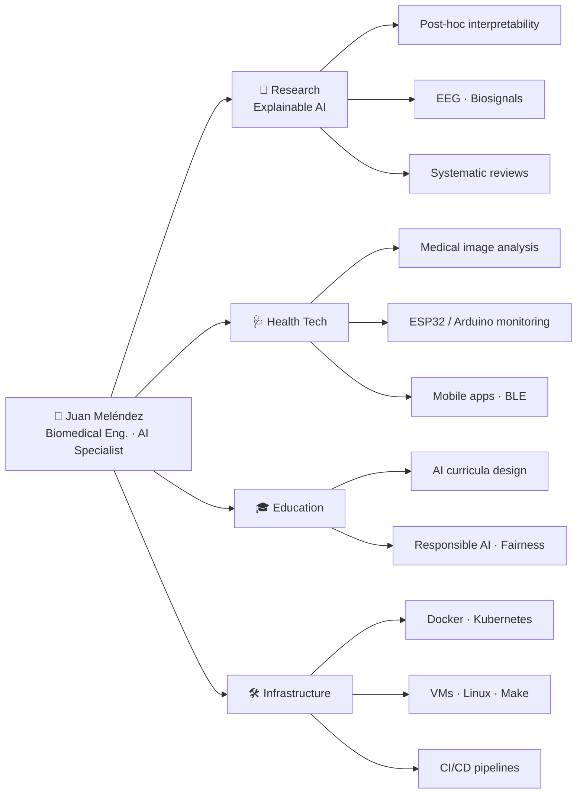

<h1 align="center">Hi, I'm Juan Meléndez 👋</h1>
<p align="center">
  
</p>

<p align="center">
  <i>Building AI that clinicians can trust — and the hardware to make it real.</i>
</p>

<p align="center">
  
  
  
  
</p>

---

## 🧬 About Me

**Biomedical engineer** · *Especialista en Inteligencia Artificial*.

Turning EEG signals into interpretable models · building health hardware with ESP32 · teaching AI in Colombia.

```python
class JuanMelendez:
    def __init__(self):
        self.role       = "Biomedical Engineer · AI Specialist"
        self.research   = "Explainable AI (XAI) — interpretability of black-box models"
        self.domains    = ["Medical imaging", "Biosignals (EEG)",
                           "EdTech", "IoT health devices"]
        self.stack      = ["Python", "PyTorch", "TensorFlow/Keras",
                           "scikit-learn", "OpenCV", "Docker", "K8s", "ESP32"]
        self.currently  = "Leading an XAI research group & designing AI curricula"

    def motto(self):
        return "If a model can't explain itself, it isn't ready for a patient."
```

---

## 🗺️ What I Work On

<!-- One node, many paths -->


---

## 🔬 Research — Explainable AI

I **lead a research group on Explainable Artificial Intelligence**, focused on making post-hoc interpretability rigorous and useful in high-stakes domains.

| Line of work | Description | Status |
|---|---|---|
| 🧠 **EEG + Interpretable Deep Learning** | Detection of alcohol use disorder from EEG signals using interpretable deep learning | ✅ Accepted — **IEEE STSIVA 2026** |
| 📚 **Systematic Review (PRISMA 2020)** | Post-hoc, model-agnostic interpretability methods — a structured map of the field | 📝 Under submission |
| 🌌 **J-Space** | Interpretability project exploring alternative representation spaces for explanation | 🚧 Active |

---

## 👩‍💻 Current Work

- 🩺 Developing **machine learning applications for biomedical engineering**, including monitoring systems with **ESP32/Arduino** and **medical image analysis**.
- 🌍 Educational tools and biomedical monitoring systems, built with multidisciplinary teams.
- 🕵️ **SospechAI** — a multiplayer conversational game where players must figure out which participant is a language model. Built with a team of 4 and shipped through a **CI/CD pipeline**.
- 🤖 **Local AI stack ("Jarvis Local")** — self-hosted LLM tooling running on Linux.

## 📚 Learning Now

- 🐍 Implementing **web servers with Django** and developing **databases in SQL**.
- 🎨 Designing **accessible and functional web interfaces** using HTML and CSS.
- ☸️ **Container orchestration and resource management** — Kubernetes, virtualization and reproducible builds.
- 🎓 Advancing **methodologies in Artificial Intelligence** through my specialization program.

---

## 🎓 Teaching & Curriculum Design

Beyond research, I design **university-level AI course content** for Colombian higher-education institutions:

- 🧭 **Responsible AI / Data Science Ethics** — syllabus, activity guides and a hands-on **ML fairness notebook** for a graduate program in Data Analytics & AI.
- 🧪 Practical material that connects theory with real notebooks, datasets and reproducible experiments.
- 📄 **Academic reporting and professional documentation** as a core deliverable.

---

## 🛠️ Tech Stack

<details open>
<summary><b>🤖 Machine Learning & AI</b></summary>
<br>
<p>
  
  
  
  
  
  
  
  
  
  
</p>
<i>Machine learning · predictive modeling · computer vision · medical image analysis · signal processing</i>
</details>

<details open>
<summary><b>📊 Data Visualization & Data Apps</b></summary>
<br>
<p>
  
  
  
  
</p>
</details>

<details open>
<summary><b>💻 Languages, Web & Mobile</b></summary>
<br>
<p>
  
  
  
  
  
  
  
  
  
  
</p>
</details>

<details open>
<summary><b>🔌 Embedded Systems & IoT</b></summary>
<br>
<p>
  
  
  
  
</p>
</details>

<details open>
<summary><b>⚙️ Infrastructure, DevOps & Systems</b></summary>
<br>
<p>
  
  
  
  
  
  
  
  
  
</p>
<i>Resource management · containerization · virtualization · reproducible builds · deployment pipelines</i>
</details>

<details open>
<summary><b>🗺️ Geolocation, Automation & Productivity</b></summary>
<br>
<p>
  
  
  
  
  
  
  
</p>
<i>Route optimization · data automation, processing and export</i>
</details>

<details>
<summary><b>🧩 Ways of Working</b></summary>
<br>

- 📝 **Academic reporting and professional documentation**
- 🧪 **Experimentation workflows** with JupyterLab and notebooks
- 🗂️ **Project management** with Trello, Notion and Google Drive

</details>

---

## 📊 GitHub Stats

<p align="center">
  
  
</p>

<p align="center">
  
</p>

---

## 🤝 Let's Connect

<p align="center">
  <a href="https://www.linkedin.com/in/juan-camilo-mel%C3%A9ndez-torres-805935263/" target="_blank">
    
  </a>
  <a href="mailto:juancamelendezt@gmail.com">
    
  </a>
  <a href="mailto:juan_camilo.melendez@uao.edu.co">
    
  </a>
  <a href="https://orcid.org/0009-0006-8026-6096" target="_blank">
    
  </a>
</p>

<p align="center">
  
</p>
